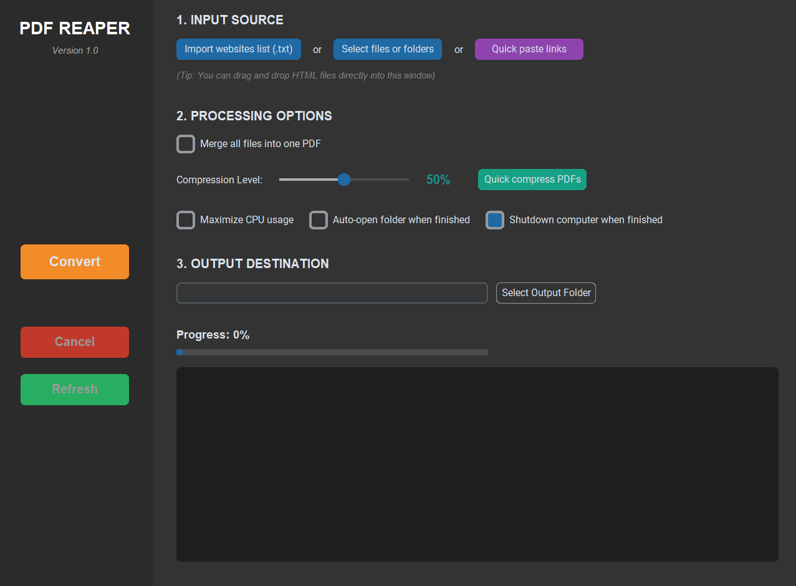

# PDF Reaper v1.0

PDF Reaper is a high-performance desktop utility designed to convert web URLs and local HTML files into professional-grade PDF documents.

## Features

- **Async Rendering**: Powered by Playwright to handle JS-heavy pages and automatic cookie banner suppression.
- **Parallel Processing**: Multi-threaded execution to render and compress multiple sources simultaneously.
- **Advanced Compression**: Variable compression levels (0-100%) using the PyMuPDF engine.
- **Smart Workflow**:
    - **Merge**: Combine multiple sources into a single unified PDF.
    - **Split**: Automatically paginate large documents into equal chunks.
    - **Preserve Filenames**: Output files maintain their original HTML/URL titles.

## Installation

### Prerequisites
- Python 3.8 or higher
- Node.js (Required for Playwright browser binaries)

### Setup
1. Clone the repository:
   ```bash
   git clone https://github.com/moonlightspeed/PDF-Reaper.git
   cd PDF-Reaper 
2. Install dependencies:
    ```bash
    pip install -r requirements.txt
3. Install Chromium binaries for the rendering engine:
    ```bash
    playwright install chromium

## Usage

Launch the application:
```bash
python main.py 
```

## Technical Guides

### 1. Handling Tree-Link Documentations (e.g., Unity Docs)
To convert an entire documentation tree (like the Unity Manual) into one PDF, you need a list of all sub-page URLs. Instead of copying manually, use the browser **Console Inspect**:

1. Open the documentation page (e.g., Unity Manual) in your Chromium-based browser.
2. Open **Developer Tools**.
3. Go to the **Console** tab.
4. Paste the following script. **Important:** Change the `'/docs/2.03/studio/'` part to match the specific URL path of the documentation you are targeting (e.g., `'Manual'` for Unity).
   ```javascript
   var links = [...new Set(
       Array.from(document.querySelectorAll('a'))
       .map(a => a.href.split('#')[0]) // Remove anchor tags to prevent page duplication
       .filter(href => href.includes('/docs/2.03/studio/') && href.endsWith('.html')) // <-- CHANGE KEYWORD HERE
   )];
   console.log(links.join('\n'));
   ```
5. Copy the output list and use the Quick paste links button in PDF Reaper. 
6. Enable Merge all files into one PDF to generate your offline manual.

### 2. Chromium Engine Setup
The app requires the Chromium browser binaries to function.
- For Developers:
  After installing dependencies, run this command in your terminal:
```bash
playwright install chromium
```
- For End Users (Compiled version):
The app will prompt you to download Chromium on the first execution if it is missing. If the automated process fails, run the command below in terminal:
```bash
playwright install chromium
```

### Build Executable
To package the application for Windows:
```bash
pyinstaller --noconfirm --onedir --windowed --add-data "pdf_engine.py;." --icon "reap.ico" --name "PDF_Reaper" --collect-all playwright main.py
```

## Project Structure
- main.py: GUI and application orchestration.
- pdf_engine.py: Multi-threaded rendering and compression logic.
- reap.ico: Application icon.
- github.png: UI asset.
- requirements.txt: List of Python dependencies.

## Technical Notes
- CPU Utilization: The tool scales based on available hardware. Maximize CPU usage can be toggled to balance performance and system stability.
- Compression: Level 0 provides lossless output, while higher levels apply structural cleaning and stream deflation.

## License
Distributed under the GNU License. Please read the License file.